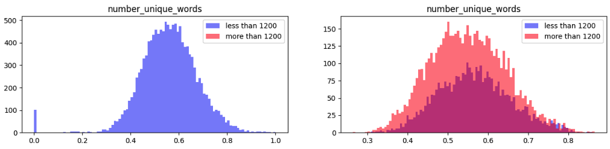
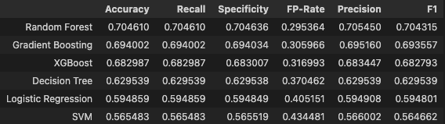
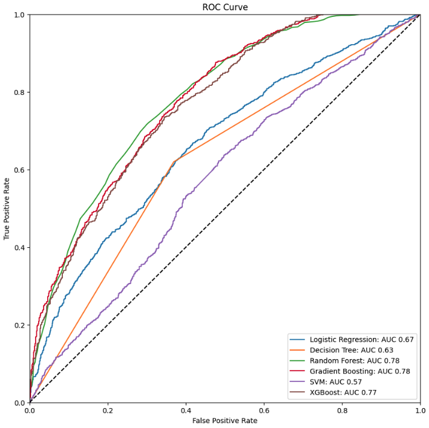
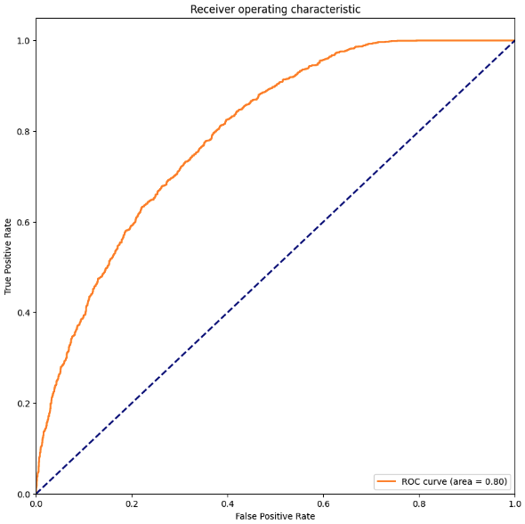
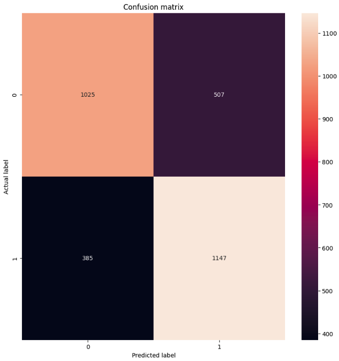

# Success post prediction with Machine Learning

## Getting started

This repository contains the code for the example case.

A case is raised to evaluate internet postings, based on certain input parameters, it is intended to build a model that can predict if a posting will be successful or not, for this there is a dataset of postings and their number of views.

The objective variable is related to the number of visits to the post, if a post receives more than 1200 visits it is considered successful, otherwise it will be considered non-successful.

The practical activity is carried out in python.

## Prerequisites

- Python 3.9
- Jupyter Notebook

## 1 - Exploratory Data Analysis into Jupyter Notebook

The first step is to explore the data and build a model. The notebook is available in the `notebooks` folder.

- open the notebook `notebooks/01-EDA.ipynb`

I start by loading the dataset so that I can perform an exploratory analysis of the data.

The dataset contains:

13186 rows and 34 columns

1 - checking for missing values

The dataset has no null values

2 - verifying the content data types, we have:

| Column Data Type  | Count |
| ------------- | ------------- |
| int64  | 9  |
| float64  | 23  |
| object  | 2  |

3 - Detect numerical and categorical categories

It is verified that the `ID` variable is only an index and it is discarded as it does not provide relevant information.

target variable: `views`

| Variable Type  | Count |
| ------------- | ------------- |
| total  | 32  |
| numerical  | 30  |
| categorical  | 2  |

name of the numerical variables:

['days_diff', 'number_words_title', 'number_words_content', 'number_unique_words', 'number_no_stopwords', 'number_no_stopwords_unique', 'number_links', 'number_images', 'number_videos', 'average_word_length', 'number_of_keywords', 'score_topic_1', 'score_topic_2', 'score_topic_3', 'score_topic_4', 'score_topic_5', 'degree_of_subjectivity', 'degree_of_sentiment', 'pct_positive_words', 'pct_negative_words', 'pct_positive_words_over_sentiment_words', 'average_bias_positive_words', 'minimum_bias_positive_words', 'maximum_bias_positive_words', 'average_bias_negative_words', 'minimum_bias_negative_words', 'maximum_bias_negative_words', 'subjectivity_title', 'sentiment_title', 'abs_title_sentiment_polarity']

name of the categorical variables:

['weekday', 'category']

4 - Analysis of numerical variables

In general, when analyzing numerical variables, it is important to consider the distribution of the data, the presence of outliers, the correlation between the variables, and any other patterns or trends that may be relevant to the problem at hand.

Descriptive Statistics: Descriptive statistics summarize the distribution of numerical data. Common descriptive statistics include the mean, median, standard deviation, and quartiles.

Histograms: Histograms are graphs that represent the distribution of numerical data on a coordinate axis. The X axis represents the numeric values, and the Y axis represents the frequency with which each value appears in the data.

Boxplots: Boxplots are graphs that represent the distribution of numerical data by plotting quartiles. A boxplot shows the median (the value that divides the sample into two equal parts), the interquartile range (the range of values between the first and third quartiles), and any outliers that fall outside this range.

Correlation: Correlation is a statistical measure that indicates the strength and direction of the relationship between two numerical variables. Correlation can be positive, negative, or neutral, and ranges in strength from -1 (perfectly negative correlation) to 1 (perfectly positive correlation).

5 - Analysis of categorical variables

To analyze categorical variables, it is common to use specific descriptive and exploratory statistical techniques for this type of variable.

Bar charts: Bar charts are a common way to visualize the distribution of categorical data. Each bar represents a category, and the height of the bar indicates the number or percentage of observations in that category.

6 - The target variable is observed

When analyzing the target variable in a binary classification problem, it is important to consider the distribution of the variable's values, as this can indicate a possible class imbalance.

## 2 - Data Processing into Jupyter Notebook

The second step is to process the data and build a model. The notebook is available in the `notebooks` folder.

- open the notebook `notebooks/02-Data-Processing.ipynb`

In this notebook, the data preprocessing is carried out, among the steps carried out are:

Variable selection

Distribution of the target variable: The distribution of the target variable (the one that is trying to be predicted) must be balanced. If the distribution is lopsided, that is, if there is one class much larger than the other, the model may have difficulty predicting the minority class and may be biased towards the majority class. In this case, you may want to consider sampling techniques such as undersampling or oversampling to balance the distribution.

Distribution of the predictor variables: It is important to take into account the distribution of the predictor variables (those used to predict the target variable). Predictor variables that have a normal distribution may work well with linear models, while predictor variables that have a skewed distribution may require transformations.

Outliers: Outliers can affect the distribution of variables. It is important to be aware of outliers and decide how to handle them. Outliers can be removed or transformed to reduce their impact on the model.

Multicollinearity: Multicollinearity occurs when two or more predictor variables are highly correlated with each other. This can affect the distribution of the variables and make the model less accurate. It is important to detect and handle multicollinearity using techniques such as feature elimination or principal component analysis.

Scale of the predictor variables: The scale of the predictor variables can affect the precision of the model. You may want to standardize or normalize the predictor variables so that they are all on the same scale before fitting the model.

as a final step, the data is saved as a processed dataset and the selected variables as a json file

## 3 - Model Building into Jupyter Notebook

The third step is to build the model. The notebook is available in the `notebooks` folder.

- open the notebook `notebooks/03-Model-Building.ipynb`

The data is split into training, test, and validation sets. The training set is used to train the model, the test set is used to evaluate the model, and the validation set is used to evaluate the model after it has been deployed.

Define 6 models:

- Logistic Regression
- Decision Tree
- Random Forest
- Gradient Boosting
- Support Vector Machine (SVM)
- XGBoost

run with predeterminated parameters and compare the results:

ROC comparison:

next step is to optimize the parameters of the models using GridSearchCV

The best parameters are:

The model is trained with the best parameters and the results are:

